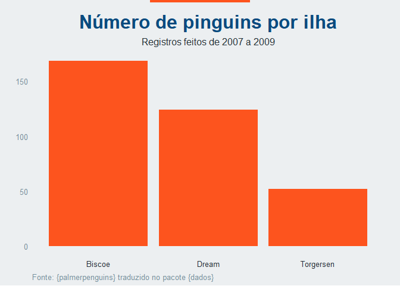

<!-- README.md is generated from README.Rmd. Please edit that file -->

# **ggimprensa** 

<!-- badges: start -->

[](https://twitter.com/BrunoHMioto)
<!-- badges: end -->

Temas dos principais jornais brasileiros para o ggplot2 Esse pacote foi
inspirado no pacote [ggthemes](https://github.com/jrnold/ggthemes)

## Instalação

Você pode instalar o pacote ggimprensa com a seguinte função:

``` r
# install.packages("devtools")
devtools::install_github("brunomioto/ggimprensa")
```

## Uso

Os temas existentes no pacote atualmente são:

-   `tema_poder360()` referente ao jornal [Poder
    360](https://www.poder360.com.br/)

-   `tema_g1()` referente ao jornal [g1 - Globo](https://g1.globo.com/)

-   `tema_nexo()` referente ao [Nexo
    Jornal](https://www.nexojornal.com.br/)

``` r
library("ggplot2")
library("ggimprensa")
```

### Poder 360

``` r
p1 <- ggplot(pinguins_grupos, aes(x = ilha, y = n)) +
  geom_col(fill = "#fd541e")+
  labs(
    title = "Número de pinguins por ilha",
    subtitle = "Registros feitos de 2007 a 2009",
    caption = "Fonte: {palmerpenguins} traduzido no pacote {dados}"
  )+
  scale_y_continuous(expand = expansion(mult = c(0,0.1)))+
  tema_poder360()

p1
```


Caso queira adicionar a faixa superior ao gráfico, utilize a função
`linha_poder360()`

``` r
linha_poder360(p1)
```



### G1

``` r
p2 <- ggplot(pinguins_grupos, aes(x = ilha, y = n)) +
  geom_col(fill = "#c6160d")+
  labs(
    title = "Número de pinguins por ilha",
    subtitle = "Registros feitos de 2007 a 2009",
    caption = "Fonte: {palmerpenguins} traduzido no pacote {dados}"
  )+
  scale_y_continuous(expand = expansion(mult = c(0,0.1)))+
  tema_g1()

p2
```


### Nexo

``` r
p3 <- ggplot(pinguins_grupos, aes(x = ilha, y = n)) +
  geom_col(fill = "#15c5ce")+
  labs(
    title = "Número de pinguins por ilha",
    subtitle = "Registros feitos de 2007 a 2009",
    caption = "Fonte: {palmerpenguins} traduzido no pacote {dados}"
  )+
  scale_y_continuous(expand = expansion(mult = c(0,0.1)))+
  tema_nexo()

p3
```


## Melhorias e sugestões

Tem alguma ideia para o pacote ou sugestão de como posso melhorá-lo?
Crie uma nova [issue](https://github.com/brunomioto/ggimprensa/issues)
para que eu possa ajudar!

## Créditos

Esse pacote foi criado por [Bruno
Mioto](https://twitter.com/BrunoHMioto)

A hex logo foi criada por [Ícaro
Bernardes](https://twitter.com/IcaroBSC)
